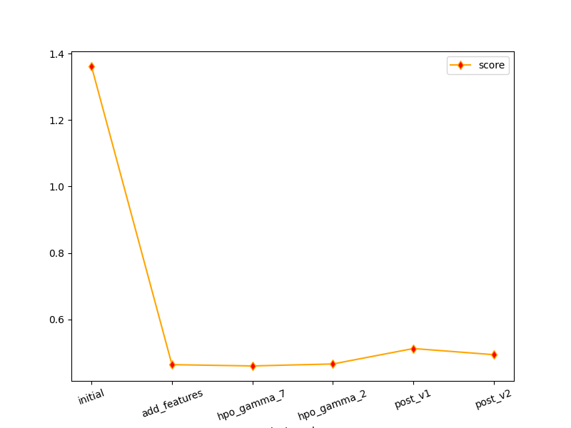

# Report: Predict Bike Sharing Demand with AutoGluon Solution
#### Barnik Roy
___

## Initial Training
### What did you realize when you tried to submit your predictions? What changes were needed to the output of the predictor to submit your results?
>1. The predictions weren't so good. It recieved a score around 1.5.
>2. During submission, I had to replace all the **negative** predictions with 0.

### What was the top ranked model that performed?
>`WeightedEnsemble_L3`
___

## Exploratory data analysis and feature creation
### What did the exploratory analysis find and how did you add additional features?
>1. Using EDA, I understood that the `pandas.DataFrame` object I created from the supplied data was mistreating some of the ***categorical*** features for ***numerical*** features. So, I had to fix it.
>2. I created `hour` feature from `datetime` feature. The process was rather simple. Because, my `pandas.DataFrame` objects treated the `datetime` feature as a `pandas.Series` of Python `datetime` objects. From there, it was just method calls.

### How much better did your model preform after adding additional features and why do you think that is?
>The effect of this stage was quite remarkable. The score dropped (*is to be closer and closer to 0*) by almost 1.

___

## Hyper parameter tuning
### How much better did your model preform after trying different hyper parameters?
> I tried many passes of model training through tuning different hyperparameters. However, there was tiny improvements in some of them. Many even did worse. I also explored some bizzare things too e.g.  
> * changed `eval_metric` from `root_mean_squared_error` to `r2`  (~~poor score~~)
> * assigned `registered` column to `sample_weight` of `TabularPredictor` (~~hardly changed anything~~)
> * tried to use `tuning_data` in `fit()` splitting the `train` dataset (~~I don't know what went wrong...even tried using `num_bag_folds` and `num_stack_levels` but it constantly threw error...and then I snapped...~~)
> * a different kind of error happened when I tried `dropout` (~~forgot to keep track of the error...~~)

### If you were given more time with this dataset, where do you think you would spend more time?
> If that was the case, I'd spend more time into individual `model_hyperparams` tuning (or maybe I'd look into individual model weights).

### Create a table with the models you ran, the hyperparameters modified, and the kaggle score.
|model|hpo1|hpo2|hpo3|score|
|--|--|--|--|--|
|initial|-|-|-|1.36139|
|add_features|-|-|-|0.46386|
|hpo|time_limit	| XGB - eta	| XGB - gamma reg., gamma |0.46000|

___

### Create a line plot showing the top model score for the three (or more) training runs during the project.

### Create a line plot showing the top kaggle score for the three (or more) prediction submissions during the project.

___

## Summary
> * The model trained after EDA might have already been sufficiently complex to capture the underlying patterns in the given data. In such cases, further increasing the model's complexity through hyperparameter tuning might not lead to significant improvements.
> * Maybe I needed to explore other possible things.
> * Also there was a bit overfitting during the hyperparameter tuning (later hidden by `verbose=0`). So maybe, I somehow needed better regularization.